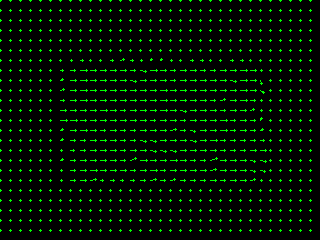

# Motion Detection
In this project, we try to detect the motion of an object in an image using Lucas Kanade method. We compute dense flow field vector using Hierarchial Luca & Kanade. The first part of this project deals with Optical flow using Lucas Kanade algorithm. We find that for for large shifts, lucas & Kanade fails to record the movement values accurately. In order to ovecome this limitation, we used Hierarchial Lucas-Kanade method. Later, we used this implementation for Frame interpolations as well.

## Instructions to run the code:
	1) run experiment.py
	
## Outputs
Small shifts demo:
  
